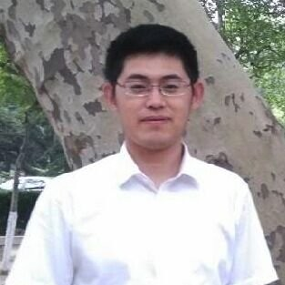

I am tenure-track-professor for *Multifactorial Data Analysis and Machine Learning in the Life Sciences* at [the Centre for organismal studies (COS)](https://www.cos.uni-heidelberg.de/en/research-groups/biological-data-science) and [the Centre for Scientific Computing (IWR)](https://typo.iwr.uni-heidelberg.de/home) of Heidelberg University.

Trained as a mathematician, I obtained a PhD in statistics from ETH Zurich and EMBL Heidelberg working with [Peter Bühlmann](https://math.ethz.ch/research/seminar-for-statistics/peter-buehlmann.html) and [Wolfgang Huber](https://www.huber.embl.de). From 2019-2022, I was a postdoc at the German Cancer Research Center and the [Wellcome Sanger Institute](https://www.sanger.ac.uk) in Cambridge. As a visiting researcher I worked with [Susan Holmes at Stanford University](https://susan.su.domains/) and with [Dagmar Iber at D-BSSE](https://bsse.ethz.ch/cobi).

In my research, I aim to apply statistical reasoning in combination with modern machine learning approaches to gain insights into fundamental processes that underlie complex biological systems and dissect the molecular heterogeneity of biological processes. For this I develop statistical methods and computational tools to analyse and integrate 'omics data and apply them in a variety of fields including personalized medicine, cancer biology, single cell biology and developmental biology. The tools and methods I develop are available from [Bioconductor](https://www.bioconductor.org), [PyPI](https://pypi.org) and GitHub.

You can find me on [Twitter](https://twitter.com/brittavelten), [LinkedIn](https://www.linkedin.com/in/britta-velten-22a36813a), [Google Scholar](https://scholar.google.de/citations?user=sJ2lkaAAAAAJ&hl=de&oi=ao) and [GitHub](https://github.com/bv2).

 

{width=200px}

